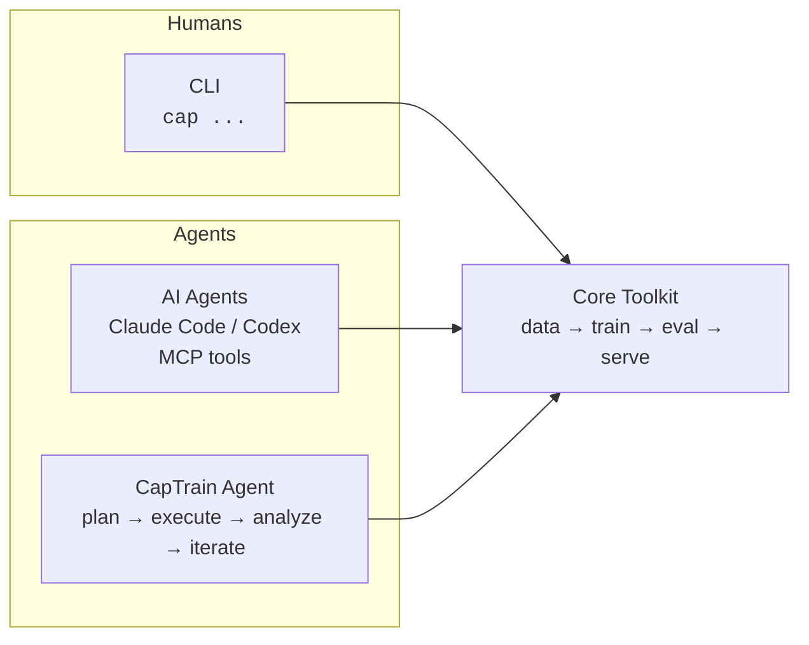
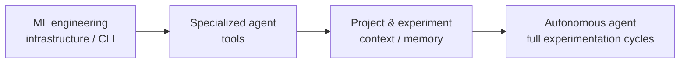
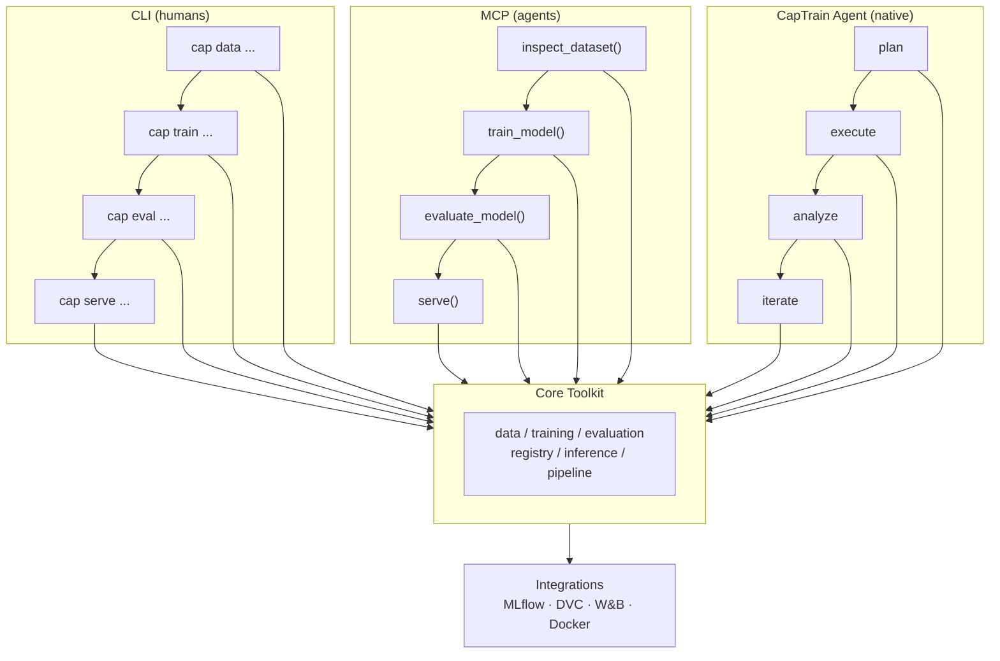
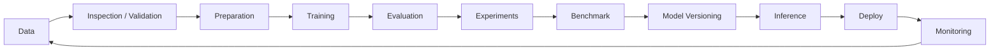

<div align="center">

# CapTrain

**Claude Code writes software. CapTrain engineers models.**

A unified ML engineering layer, built around a single core: CLI for humans, MCP for agents, and a native **AI Agent purpose-built for the ML lifecycle** — dataset validation, training, evaluation, experiment tracking, and deployment prep, done reproducibly and with justified decisions, not just executed ones.


[](./LICENSE)
[](https://pypi.org/project/captrain/)
[](https://pypi.org/project/captrain/)
[](https://github.com/masteryogo/captrain/actions)
[](https://github.com/masteryogo/captrain/graphs/contributors)

---

[Quick Start](#quick-start) · [Features](#core-features) · [AI Agent Vision](#the-ai-agent-vision) · [Architecture](#architecture) · [Roadmap](#roadmap) · [Contributing](#contributing) · [**Português (PT-BR)**](./README_PT.md)

</div>

---

## What is CapTrain?

CapTrain is a **single engineering layer for the full ML/AI lifecycle** — from data inspection to production monitoring — exposed through three interfaces that share one core: a CLI for humans, MCP tools for external agents, and a native AI Agent that can plan, execute, analyze, and iterate on experiments directly. The same capability is available whether you're a developer at a terminal, a coding agent connecting through MCP, or the CapTrain agent operating on its own — the same way Claude Code operates on a codebase, but specialized end-to-end for machine learning, where "it ran without errors" is not the same thing as "it's correct."



> **One core. Every interface.** CLI, MCP, and the native agent are layers over a single, shared toolkit — zero duplicated logic.

### Why CapTrain?

- **Humans and agents, equal citizens** — every function is reachable from a terminal, an LLM via MCP, or the native agent, with structured (JSON) output throughout.
- **Confidence, not just speed** — the goal isn't just to run experiments fast, it's to make every result defensible: correct splits, justified metrics, no leakage, beaten baselines.
- **A companion, not a replacement** — integrates with MLflow, DVC, W&B and Docker instead of competing with them.
- **Observability by default** — logging, metrics, and traceability from day one.
- **Ecosystem-friendly** — a thin, opinionated layer on top of the tools you already use.
- **Community-driven** — open from day one to shape the roadmap with the ML community, especially the Brazilian ML/MLOps community.

---

## Quick Start

```bash
# Install
pip install captrain

# Initialize an ML project
cap init

# Inspect a dataset
cap data inspect data/dataset.csv

# Run a full lifecycle pipeline
cap pipeline run --config pipeline.yaml
```

That's it. Install, initialize, and run your first end-to-end pipeline in under a minute.

---

## Core Features

| Stage | CLI | MCP Tool | What it does |
|-------|-----|----------|--------------|
| Data inspection | `cap data inspect` | `inspect_dataset()` | Schema, metrics, and anomaly detection |
| Data validation | `cap data validate` | `validate_dataset()` | Quality rules, types, and nulls |
| Data preparation | `cap dataset prepare` | `prepare_dataset()` | Cleaning, encoding, and splitting |
| Training | `cap train` | `train_model()` | Training with hyperparameters |
| Evaluation | `cap eval` | `evaluate_model()` | Metrics, reports, and plots |
| Experiments | `cap experiment compare` | `compare_experiments()` | Run ranking and diffs |
| Benchmark | `cap benchmark` | `benchmark()` | Performance benchmarking |
| Model registry | `cap model register` | `register_model()` | Versioning and registry |
| Batch inference | `cap predict` | `predict()` | Batch prediction |
| Serving | `cap infer serve` | `serve()` | Inference server |
| Orchestration | `cap pipeline run` | `run_pipeline()` | End-to-end orchestration |

---

## The AI Agent

CapTrain isn't just an ML engineering CLI with an agent bolted on — the agent is a core interface, on equal footing with the CLI and MCP, purpose-built for the ML lifecycle. Think "Claude Code for ML."

ML engineers describe tasks in natural language, and the agent **plans, executes, analyzes, and iterates** on ML experiments reproducibly — and defensibly. It owns:

- Dataset analysis and validation
- EDA and preprocessing
- Baseline creation
- Training and fine-tuning
- Hyperparameter tuning
- Model evaluation and comparison
- Experiment execution and tracking
- Experiment tracking and versioning
- Diagnosing overfitting and data leakage
- Model selection
- Report generation
- Inference/deployment prep

### How the agent is built



The agent is built on the same core as the CLI and MCP tools — it doesn't bypass it:

- The ML engineering infrastructure/CLI is the foundation every interface calls into.
- Specialized tools (below) are what the agent calls to avoid domain-specific mistakes.
- Context and memory of projects and experiments keep the agent grounded across sessions.
- Full plan → execute → analyze → iterate cycles are what the agent runs end to end.

### Specialized Agent Toolkit

The core bet: a generic coding agent running arbitrary Python can execute an ML pipeline, but it has no domain guardrails against the mistakes that quietly invalidate results. These tools exist to catch that class of error before it reaches a report.

| Block | Tools | Catches |
|-------|-------|---------|
| **Data integrity** | `check_leakage()`, `check_split_validity()`, `check_duplicate_rows_across_splits()` | Leaked targets, wrong split strategy, train/test overlap |
| **Evaluation sanity** | `suggest_metric()`, `baseline_comparator()`, `confidence_interval()` | Wrong metric for the problem, unbeaten trivial baselines, noise mistaken for signal |
| **Over/underfitting diagnostics** | `learning_curve_analyzer()`, `feature_importance_sanity_check()` | Overfitting, underfitting, disguised leakage via a dominant feature |
| **Reproducibility & provenance** | `experiment_diff()`, `data_version_lock()` | Untraceable run differences, comparisons across mismatched data snapshots |
| **The Justifier** *(pipeline gate, not a tool)* | Structured checklist before reporting a final result: split ok? metric justified? baseline beaten? no leakage? | Unearned confidence in a result — turns "94% accuracy" into "94%, and here's why we trust it" |

Implementation priority: **data integrity and evaluation sanity first** — leakage and the wrong metric are the two most common, most trust-destroying mistakes, and the easiest to catch with simple heuristics.

### CapTrain thinks like a senior ML engineer

Beyond the core toolkit, these are the requirements that decide whether an ML engineering agent gets trusted in a real workflow, not just a demo:

- **Cost awareness** — `estimate_cost()` before any expensive run, plus a configurable spend ceiling requiring human approval.
- **Slice-level evaluation** — break down evaluation by relevant subgroups by default, not just aggregate metrics; surface hidden gaps in minority slices.
- **Human-in-the-loop by default** — mandatory approval checkpoints before irreversible steps (production promotion, final training data selection).
- **Data unit tests** — automated schema, distribution/drift, and null checks on every new dataset or dataset version.
- **Strict execution sandboxing** — isolated execution for agent-generated code: no unnecessary network access, no writes outside controlled directories.
- **Existing-stack integration** — MLflow, DVC, W&B, Vertex AI, SageMaker — composition, not replacement.
- **Agent decision explainability** — a reviewable reasoning log for *why* the agent chose an algorithm/split/hyperparameter, distinct from model explainability (SHAP, etc.).
- **Easy rollback** — revert to a prior model/data/config state in seconds, with a navigable history.
- **Post-deploy monitoring** — data drift, model drift, and business-metric degradation as a continuous part of the lifecycle, not an afterthought.
- **Multiplayer from day one** — experiments, decisions, and reports visible and reviewable by a team, not locked to a single terminal session.

---

## Architecture



```
captrain/
├── src/
│   └── captrain/
│       ├── cli/              # CLI interface (Click/Typer)
│       ├── core/             # Central logic
│       │   ├── data/         # Inspection, validation, preparation
│       │   ├── training/     # Training and experiments
│       │   ├── evaluation/   # Evaluation and benchmarks
│       │   ├── registry/     # Versioning and registration
│       │   ├── inference/    # Serving and batch
│       │   └── pipeline/     # Orchestration
│       ├── mcp/              # MCP tools for agents
│       ├── agent/            # Native agent: planning, tools, memory
│       └── integrations/     # MLflow, DVC, W&B, etc.
├── tests/
└── pyproject.toml
```

---

## ML Lifecycle

CapTrain is designed around the complete model lifecycle:



---

## Integrations

CapTrain composes with the ecosystem instead of reinventing it.

| Integration | Purpose |
|-------------|---------|
| **MLflow** | Experiment tracking and model registry |
| **DVC** | Data and pipeline versioning |
| **W&B** | Experiment visualization and logging |
| **Docker** | Reproducible serving and deployment |

---

## Design Principles

- **CLI, MCP, and Agent are three faces of the same coin** — every feature is reachable via all three.
- **Centralized core** — zero duplicated logic between interfaces.
- **Ecosystem, not a substitute** — composes with MLflow, DVC, W&B instead of competing.
- **Built-in observability** — logs, metrics, and traceability from the start.
- **Agent-friendly** — structured output (JSON) for direct LLM consumption.
- **Justified, not just executed** — every agent-driven result carries the reasoning behind it.

---

## Roadmap

We're building the full core — CLI, MCP, and Agent — in parallel tracks, not as separate stages bolted on later.

| Track | Focus | Status |
|-------|-------|--------|
| **Foundation** | Package skeleton, `pyproject.toml`, CI, tests | in progress |
| **Data layer** | `data inspect`, `validate`, `prepare` | planned |
| **Training & Eval** | `train`, `eval`, experiment comparison | planned |
| **Registry & Inference** | model versioning, `predict`, `serve` | planned |
| **MCP interface** | expose core as MCP tools for agents | planned |
| **Orchestration & Monitoring** | `pipeline run`, production monitoring | planned |
| **Agent toolkit** | leakage/metric/overfitting checks, the Justifier gate | planned |
| **Agent memory & context** | project and experiment history, continuity across sessions | planned |
| **Native agent** | full plan → execute → analyze → iterate cycles | planned |

See the [open issues](https://github.com/masteryogo/captrain/issues) for the most current priorities.

---

## Contributing

CapTrain is **community-driven and open to all** — especially the Brazilian ML/MLOps community. If you care about clean ML engineering or AI agents, we'd love to have you.

- Check out [CONTRIBUTING.md](./CONTRIBUTING.md) for the full guide.
- Look for [`good-first-issue`](https://github.com/masteryogo/captrain/issues?q=is%3Aissue+is%3Aopen+label%3A%22good+first+issue%22) to get started.
- Non-trivial changes start with an issue to discuss design first.

---

## Maintainers

- **João Pedro Matos** — founder & lead maintainer ([masteryogo](https://github.com/masteryogo))

---

## Community

- **Docs** — coming soon
- **Discussions** — [GitHub Discussions](https://github.com/masteryogo/captrain/discussions)
- **Issues** — [GitHub Issues](https://github.com/masteryogo/captrain/issues)
- **Community** — reach out via the maintainers for Discord/Slack invites

---

## License & Citation

CapTrain is licensed under the **Apache License 2.0**. See [LICENSE](./LICENSE).

If you use CapTrain in your research or work, please cite it:

```bibtex
@software{capmodels,
  author = {Jo{\~a}o Pedro Matos and CapTrain Contributors},
  title = {CapTrain: A unified ML/AI engineering layer for humans and agents},
  url = {https://github.com/masteryogo/captrain},
  version = {0.1.0},
  year = {2026}
}
```

---

## Português (PT-BR)

**Este projeto também fala português.** A versão em português brasileiro do README está disponível em [**README_PT.md**](./README_PT.md).