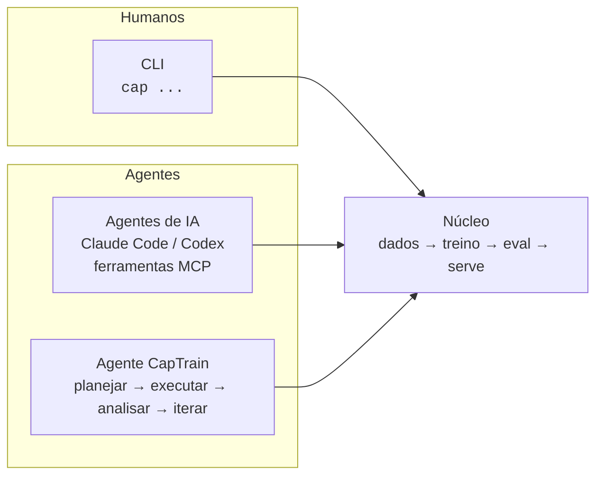
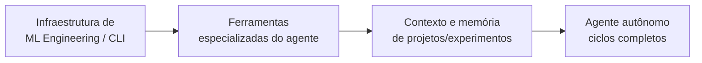
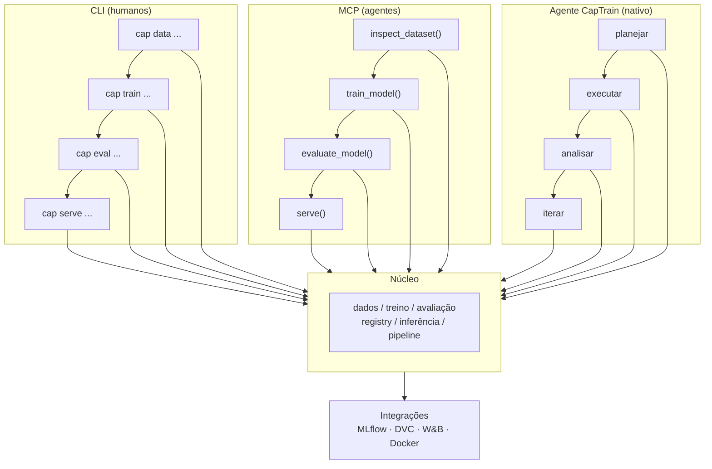
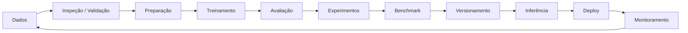

<div align="center">

# CapTrain

**O Claude Code escreve software. CapTrain engenha modelos.**

Uma camada unificada de engenharia de ML, construída em torno de um único núcleo: CLI para humanos, MCP para agentes, e um **AI Agent nativo construído especificamente para o ciclo de vida de ML** — validação de datasets, treino, avaliação, tracking de experimentos e preparação para deploy, feitos de forma reproduzível e com decisões justificadas, não só executadas.


[](./LICENSE)
[](https://pypi.org/project/captrain/)
[](https://pypi.org/project/captrain/)
[](https://github.com/masteryogo/captrain/actions)
[](https://github.com/masteryogo/captrain/graphs/contributors)

---

[Início Rápido](#início-rápido) · [Recursos](#recursos-principais) · [Visão do AI Agent](#a-visão-do-ai-agent) · [Arquitetura](#arquitetura) · [Roadmap](#roadmap) · [Contribuição](#contribuição) · [**English**](./README.md)

</div>

---

## O que é CapTrain?

CapTrain é uma **camada única de engenharia para todo o ciclo de vida de ML/AI** — da inspeção de dados ao monitoramento em produção — exposta por três interfaces que compartilham um mesmo núcleo: uma CLI para humanos, ferramentas MCP para agentes externos, e um AI Agent nativo capaz de planejar, executar, analisar e iterar sobre experimentos diretamente. A mesma capacidade está disponível tanto para um desenvolvedor no terminal, quanto para um agente de codificação conectado via MCP, quanto para o próprio agente do CapTrain operando sozinho — do mesmo jeito que o Claude Code opera sobre uma base de código, mas especializado de ponta a ponta em machine learning, onde "rodou sem erro" não é a mesma coisa que "está correto".



> **Um núcleo. Toda interface.** CLI, MCP e o agente nativo são camadas sobre um único toolkit compartilhado — zero lógica duplicada.

### Por que CapTrain?

- **Humanos e agentes como cidadãos iguais** — toda função está acessível pelo terminal, por um LLM via MCP ou pelo agente nativo, com saída estruturada (JSON) em todos os casos.
- **Confiança, não só velocidade** — o objetivo não é só rodar experimentos rápido, é tornar cada resultado defensável: splits corretos, métricas justificadas, sem leakage, baselines batidas.
- **Um complemento, não um substituto** — integra com MLflow, DVC, W&B e Docker em vez de competir com eles.
- **Observabilidade por padrão** — logs, métricas e rastreabilidade desde o primeiro dia.
- **Amigável ao ecossistema** — uma camada fina e opinativa sobre as ferramentas que você já usa.
- **Conduzido pela comunidade** — aberto desde o início para moldar o roadmap com a comunidade de ML, especialmente a comunidade brasileira de ML/MLOps.

---

## Início Rápido

```bash
# Instalar
pip install captrain

# Inicializar um projeto de ML
cap init

# Inspecionar um dataset
cap data inspect data/dataset.csv

# Rodar um pipeline completo do ciclo de vida
cap pipeline run --config pipeline.yaml
```

Pronto. Instale, inicialize e rode seu primeiro pipeline de ponta a ponta em menos de um minuto.

---

## Recursos Principais

| Etapa | CLI | Ferramenta MCP | O que faz |
|-------|-----|----------------|-----------|
| Inspeção de dados | `cap data inspect` | `inspect_dataset()` | Schema, métricas e detecção de anomalias |
| Validação de dados | `cap data validate` | `validate_dataset()` | Regras de qualidade, tipos e nulos |
| Preparação de dados | `cap dataset prepare` | `prepare_dataset()` | Limpeza, encoding e splitting |
| Treinamento | `cap train` | `train_model()` | Treino com hiperparâmetros |
| Avaliação | `cap eval` | `evaluate_model()` | Métricas, relatórios e gráficos |
| Experimentos | `cap experiment compare` | `compare_experiments()` | Ranking e diffs entre runs |
| Benchmark | `cap benchmark` | `benchmark()` | Benchmark de performance |
| Registro de modelos | `cap model register` | `register_model()` | Versionamento e registro |
| Inferência em batch | `cap predict` | `predict()` | Predição em batch |
| Servimento | `cap infer serve` | `serve()` | Servidor de inferência |
| Orquestração | `cap pipeline run` | `run_pipeline()` | Orquestração ponta a ponta |

---

## O AI Agent

O agente é uma interface central, no mesmo nível da CLI e do MCP, construída especificamente para o ciclo de vida de ML. Pense num "Claude Code para ML".

ML Engineers descrevem tarefas em linguagem natural, e o agente **planeja, executa, analisa e itera** sobre experimentos de ML de forma reproduzível — e defensável. Ele assume:

- Análise e validação de datasets
- EDA e preprocessing
- Criação de baselines
- Treinamento e fine-tuning
- Hyperparameter tuning
- Avaliação e comparação de modelos
- Execução e acompanhamento de experimentos
- Experiment tracking e versionamento
- Diagnóstico de overfitting e data leakage
- Seleção de modelos
- Geração de relatórios
- Preparação para inferência/deployment

### Como o agente é construído



O agente é construído sobre o mesmo núcleo da CLI e das ferramentas MCP — ele não contorna esse núcleo:

- A infraestrutura/CLI de ML Engineering é a base sobre a qual toda interface opera.
- As ferramentas especializadas (abaixo) são o que o agente chama pra evitar erros específicos de domínio.
- O contexto e a memória de projetos e experimentos mantêm o agente ancorado entre sessões.
- Os ciclos completos de planejar → executar → analisar → iterar são o que o agente roda de ponta a ponta.

### Ferramentas Especializadas do Agente

A aposta central: um agente de código genérico rodando Python arbitrário consegue executar um pipeline de ML, mas não tem barreiras de domínio contra os erros que invalidam resultados silenciosamente. Essas ferramentas existem pra pegar essa classe de erro antes que ela chegue a um relatório.

| Bloco | Ferramentas | O que evita |
|-------|-------------|--------------|
| **Integridade de dados** | `check_leakage()`, `check_split_validity()`, `check_duplicate_rows_across_splits()` | Vazamento de target, estratégia de split errada, overlap entre train/test |
| **Sanidade da avaliação** | `suggest_metric()`, `baseline_comparator()`, `confidence_interval()` | Métrica errada pro problema, baseline trivial não batida, ruído confundido com sinal |
| **Diagnóstico de over/underfitting** | `learning_curve_analyzer()`, `feature_importance_sanity_check()` | Overfitting, underfitting, leakage disfarçado por feature dominante |
| **Reprodutibilidade e proveniência** | `experiment_diff()`, `data_version_lock()` | Diferenças não rastreáveis entre runs, comparações entre snapshots de dado diferentes |
| **O Justificador** *(gate de pipeline, não uma ferramenta)* | Checklist estruturado antes de reportar resultado final: split ok? métrica justificada? baseline batida? sem leakage? | Confiança não merecida em um resultado — transforma "94% de acurácia" em "94%, e aqui está por que confiamos" |

Prioridade de implementação: **integridade de dados e sanidade da avaliação primeiro** — leakage e métrica errada são os dois erros mais comuns, mais destrutivos pra confiança, e mais fáceis de detectar com heurísticas simples.

### O CapModels pensa como um ML engineer sênior)

Além do toolkit central, esses são os requisitos que decidem se um agente de engenharia de ML ganha confiança num fluxo real, não só numa demo:

- **Consciência de custo** — `estimate_cost()` antes de qualquer execução cara, mais um teto de gasto configurável que exige aprovação humana.
- **Avaliação em slices** — quebrar avaliação por subgrupos relevantes por padrão, não só métrica agregada; expor buracos escondidos em slices minoritários.
- **Human-in-the-loop por padrão** — checkpoints de aprovação obrigatórios antes de etapas irreversíveis (promoção a produção, seleção final de dado de treino).
- **Testes de unidade de dado** — checagens automáticas de schema, distribuição/drift e nulos em cada novo dataset ou versão.
- **Sandbox estrito de execução** — execução isolada para código gerado pelo agente: sem acesso à rede desnecessário, sem escrita fora de diretórios controlados.
- **Integração com stack existente** — MLflow, DVC, W&B, Vertex AI, SageMaker — composição, não substituição.
- **Explicabilidade da decisão do agente** — log de raciocínio revisável sobre *por que* o agente escolheu um algoritmo/split/hiperparâmetro, distinto da explicabilidade do modelo (SHAP etc.).
- **Rollback fácil** — reverter pra um estado anterior de modelo/dado/config em segundos, com histórico navegável.
- **Monitoramento pós-deploy** — data drift, model drift e degradação de métrica de negócio como parte contínua do ciclo de vida, não um afterthought.
- **Multiplayer desde o início** — experimentos, decisões e relatórios visíveis e revisáveis por um time, não presos a uma sessão individual de terminal.

---

## Arquitetura



```
captrain/
├── src/
│   └── captrain/
│       ├── cli/              # Interface CLI (Click/Typer)
│       ├── core/             # Lógica central
│       │   ├── data/         # Inspeção, validação, preparação
│       │   ├── training/     # Treinamento e experimentos
│       │   ├── evaluation/   # Avaliação e benchmarks
│       │   ├── registry/     # Versionamento e registro
│       │   ├── inference/    # Servimento e batch
│       │   └── pipeline/     # Orquestração
│       ├── mcp/              # Ferramentas MCP para agentes
│       ├── agent/            # Agente nativo: planejamento, ferramentas, memória
│       └── integrations/     # MLflow, DVC, W&B, etc.
├── tests/
└── pyproject.toml
```

---

## Ciclo de Vida de ML

CapTrain é projetado em torno do ciclo de vida completo do modelo:



---

## Integrações

CapTrain compõe com o ecossistema em vez de reinventá-lo.

| Integração | Propósito |
|------------|-----------|
| **MLflow** | Tracking de experimentos e registry de modelos |
| **DVC** | Versionamento de dados e pipelines |
| **W&B** | Visualização e logging de experimentos |
| **Docker** | Servimento e deploy reproduzíveis |

---

## Princípios de Design

- **CLI, MCP e Agente como três faces da mesma moeda** — toda funcionalidade acessível pelos três.
- **Núcleo centralizado** — zero lógica duplicada entre interfaces.
- **Ecossistema, não substituto** — compõe com MLflow, DVC, W&B em vez de competir.
- **Observabilidade embutida** — logs, métricas e rastreabilidade desde o início.
- **Amigável a agentes** — saída estruturada (JSON) para consumo direto por LLMs.
- **Justificado, não só executado** — todo resultado gerado pelo agente carrega o raciocínio por trás dele.

---

## Roadmap

Estamos construindo o núcleo completo — CLI, MCP e Agente — em frentes paralelas, não como estágios separados encaixados depois.

| Frente | Foco | Status |
|--------|------|--------|
| **Fundação** | Esqueleto do pacote, `pyproject.toml`, CI, testes | em andamento |
| **Camada de dados** | `data inspect`, `validate`, `prepare` | planejado |
| **Treino & Eval** | `train`, `eval`, comparação de experimentos | planejado |
| **Registry & Inferência** | versionamento, `predict`, `serve` | planejado |
| **Interface MCP** | expor o núcleo como ferramentas MCP para agentes | planejado |
| **Orquestração & Monitoramento** | `pipeline run`, monitoramento em produção | planejado |
| **Toolkit do agente** | checagens de leakage/métrica/overfitting, o gate do Justificador | planejado |
| **Memória e contexto do agente** | histórico de projetos e experimentos, continuidade entre sessões | planejado |
| **Agente nativo** | ciclos completos de planejar → executar → analisar → iterar | planejado |

Veja as [issues abertas](https://github.com/masteryogo/captrain/issues) para as prioridades mais atuais.

---

## Contribuição

CapTrain é **conduzido pela comunidade e aberto a todos** — especialmente à comunidade brasileira de ML/MLOps. Se você se importa com engenharia de ML limpa ou com agentes de IA, adoraríamos ter você por aqui.

- Consulte [CONTRIBUTING.md](./CONTRIBUTING.md) para o guia completo.
- Procure por [`good-first-issue`](https://github.com/masteryogo/captrain/issues?q=is%3Aissue+is%3Aopen+label%3A%22good+first+issue%22) para começar.
- Mudanças não triviais começam com uma issue para discutir o design primeiro.

---

## Mantenedores

- **João Pedro Matos** — fundador e mantenedor principal ([masteryogo](https://github.com/masteryogo))

---

## Comunidade

- **Docs** — em breve
- **Discussões** — [GitHub Discussions](https://github.com/masteryogo/captrain/discussions)
- **Issues** — [GitHub Issues](https://github.com/masteryogo/captrain/issues)
- **Comunidade** — entre em contato pelos mantenedores para convites do Discord/Slack

---

## Licença & Citação

CapTrain é licenciado sob a **Apache License 2.0**. Veja [LICENSE](./LICENSE).

Se você usar CapTrain na sua pesquisa ou trabalho, cite:

```bibtex
@software{capmodels,
  author = {Jo{\~a}o Pedro Matos and CapTrain Contributors},
  title = {CapTrain: uma camada unificada de engenharia de ML/AI para humanos e agentes},
  url = {https://github.com/masteryogo/captrain},
  version = {0.1.0},
  year = {2026}
}
```

---

## English

**This project is bilingual.** The English version of the README is available at [**README.md**](./README.md).